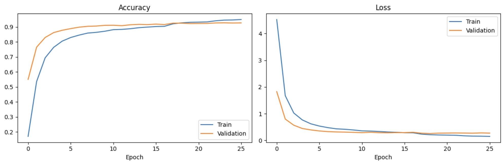
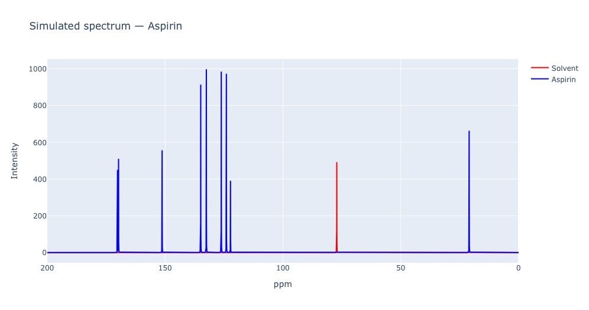

# NMR-Based Functional Group Prediction with Deep Learning

Predicting the functional groups of an organic molecule directly from its ¹H and ¹³C NMR
spectra, using convolutional neural networks trained on realistically simulated spectra.

The central idea of this project: **¹H and ¹³C NMR fail on different functional groups, and a
model that sees both is far more reliable than either alone.**

---

## Results at a glance

### Task 1 — Molecule identification (closed-set classification)

| Model | Top-1 | Top-3 | Top-5 |
|---|---|---|---|
| ¹H only (~1150 molecules) | 92.6% | 96.5% | 97.7% |
| ¹³C only | 97.8% | 99.8% | 99.97% |
| **Fusion ¹H + ¹³C** (1235 shared classes) | **99.2%** | **99.8%** | **99.9%** |



*Training curves for the ¹H classifier. Train and validation stay close throughout,
which reflects the on-the-fly spectrum generation: the model never sees the same
spectrum twice, so there is nothing to memorise.*

### Task 2 — Functional group prediction (multi-label, 15 groups)

| Model | Macro F1 |
|---|---|
| ¹H only | 0.716 |
| ¹³C only | 0.751 |
| **Fusion ¹H + ¹³C** | **0.926** |

### Per-function results — fusion model

| Functional group | Precision | Recall | F1 | Threshold |
|---|---|---|---|---|
| aldehyde | 0.989 | 0.988 | **0.989** | 0.45 |
| aromatic | 0.989 | 0.986 | **0.987** | 0.50 |
| nitrile | 0.972 | 0.953 | **0.962** | 0.65 |
| alkene | 0.983 | 0.942 | **0.962** | 0.65 |
| alcohol | 0.931 | 0.961 | **0.946** | 0.55 |
| N-heterocycle | 0.930 | 0.963 | **0.946** | 0.55 |
| sulfoxide | 0.908 | 0.942 | **0.925** | 0.55 |
| carboxylic acid | 0.915 | 0.934 | **0.924** | 0.55 |
| phenol | 0.916 | 0.927 | **0.921** | 0.75 |
| ether | 0.915 | 0.926 | **0.921** | 0.70 |
| ester | 0.895 | 0.939 | **0.917** | 0.55 |
| ketone | 0.912 | 0.908 | **0.910** | 0.60 |
| halide | 0.853 | 0.943 | **0.896** | 0.65 |
| amide | 0.856 | 0.878 | **0.867** | 0.60 |
| amine | 0.747 | 0.902 | **0.817** | 0.50 |

**Macro F1 : 0.926**

The fusion model does not merely average the two: it learns cross-modal interactions.
The clearest example is the **aldehyde** group, where fusion beats *both* single-modality
models by a wide margin:

| Functional group | ¹H | ¹³C | Fusion |
|---|---|---|---|
| aldehyde | 0.880 | 0.630 | **0.985** |
| ketone | 0.668 | 0.674 | **0.926** |
| amide | 0.567 | 0.643 | **0.859** |
| sulfoxide | 0.592 | 0.689 | **0.919** |
| nitrile | 0.665 | 0.787 | **0.954** |
| carboxylic acid | 0.659 | 0.788 | **0.904** |

Aldehyde is the textbook case: in ¹³C alone, aldehyde and ketone carbonyls sit in nearly the
same region (~190–210 ppm) and are easily confused. In ¹H, the aldehydic proton (~9–10 ppm)
is unmistakable. Only a model seeing both can combine "carbonyl carbon present" with
"aldehydic proton present" to resolve the ambiguity — which is exactly what it learns to do.

---

## Motivation

Identifying a *known* molecule from a spectral library is a solved problem, handled well by
established commercial tools. The harder and more useful question is:

> Given the spectra of an **unknown** molecule, what can we say about its structure?

This project targets that second question through multi-label prediction of functional
groups — a task that, unlike closed-set classification, generalises to molecules never seen
during training, because functional groups recur across countless different structures.

---

## Approach

### 1. Realistic synthetic spectrum generation

Spectra are generated on the fly from peak lists (ppm / intensity), by summing Lorentzian
line shapes over a fixed grid:

| Parameter | ¹H | ¹³C |
|---|---|---|
| Grid | 0–12 ppm, 30 000 points | 0–200 ppm, 30 000 points |
| Line width (randomised) | 0.0015–0.004 ppm | 0.015–0.025 ppm |
| Chemical shift jitter | ±0.1 ppm | ±1.0 ppm |
| Intensity scaling | ×0.8–1.2 | ×0.8–1.2 |
| Noise | SNR log-uniform in [150, 500], scaled to peak amplitude | same |
| Residual solvent peak | added 70% of the time (CDCl₃, DMSO-d₆, D₂O) | added 70% of the time (CDCl₃ 77.16 ppm, DMSO-d₆ 39.52 ppm) |



*Simulated ¹³C spectrum of aspirin. Blue: the molecule's own carbons — the ester
carbonyl near 170 ppm, aromatic carbons between 120 and 155 ppm, the methyl near
21 ppm. Red: the residual CDCl₃ solvent peak at 77.16 ppm, added to 70% of training
samples so the model learns to ignore it rather than treating it as part of the
molecule's signature.*

Every training sample is generated fresh, so the model never sees the same spectrum twice.
This effectively removes overfitting as a concern — there is nothing fixed to memorise.

Two parameters required particular care:

- **Grid resolution vs. line width.** If the line width approaches the grid spacing, peaks
  degenerate into single-point spikes whose sampled height fluctuates erratically with
  sub-pixel shifts. The line width must stay several times larger than the grid step.
- **Noise calibration.** Noise standard deviation is derived from a randomly drawn
  signal-to-noise ratio and the spectrum's own peak amplitude, rather than being fixed —
  otherwise the model only ever learns one acquisition quality regime.

### 2. Architecture

A 1D CNN backbone shared by both nuclei (the network is agnostic to which nucleus it is
looking at once the signal is a 30 000-point vector):

```
Input (30000, 1)
  → Conv1D(32, k=20, stride=4) → BatchNorm → MaxPool(4)
  → Conv1D(64, k=5)            → BatchNorm → MaxPool(4)
  → Conv1D(128, k=5)           → BatchNorm → MaxPool(4)
  → AveragePooling1D(8) → Flatten
  → Dense(64)        ← embedding used for transfer learning
  → Dropout(0.4)
  → Dense(n_classes, softmax)
```

### 3. Transfer learning for functional group prediction

The classification backbone is frozen and its penultimate `Dense(64)` layer is used as a
spectral embedding. For the fusion model, the ¹H and ¹³C embeddings are concatenated and fed
to a small trainable head:

```
spectrum_1H  → frozen ¹H backbone  → embedding (64)  ─┐
                                                      ├→ concat (128) → Dense(64) → Dropout
spectrum_13C → frozen ¹³C backbone → embedding (64)  ─┘   → Dense(32) → Dropout
                                                          → Dense(15, sigmoid)
```

Because functional groups are heavily imbalanced (aromatic: 44% of molecules, sulfoxide:
4.6%), training uses a **weighted binary cross-entropy** with softened positive weights
`sqrt((1 - freq) / freq)`. The un-softened `(1 - freq) / freq` weighting was tried first and
produced a badly calibrated model — very high recall, poor precision, and optimal thresholds
scattered between 0.5 and 0.8. Softening brought all optimal thresholds back into the
0.40–0.65 range, meaning the predicted probabilities became meaningful again.

Per-class decision thresholds are optimised on the validation set after training.

---

## Data

| Source | Use |
|---|---|
| **SDBS** | Initial curated set; dense point-by-point peak lists, which naturally reproduce multiplet fine structure when summed as Lorentzians |
| **HMDB / NMRShiftDB** | Bulk expansion to ~1385 ¹H molecules |
| **PubChem** (REST API) | SMILES retrieval for functional group annotation |
| **RDKit** (SMARTS matching) | Automatic annotation of 15 functional groups from SMILES |

**1233 molecules** were successfully annotated (89% coverage). The ~150 failures are mostly
large natural products, peptides and polysaccharides whose names PubChem cannot resolve —
molecules that add little functional diversity anyway.

### The 15 functional groups

`aromatic`, `alcohol`, `phenol`, `carboxylic acid`, `ketone`, `aldehyde`, `amine`, `ester`,
`ether`, `halide`, `nitrile`, `amide`, `N-heterocycle`, `sulfoxide`, `alkene`

`nitro` was deliberately dropped (only 11 molecules — far below the threshold at which
anything can be learned reliably).

---

## Things that went wrong, and what they taught me

This section is the part of the project I find most valuable. Every one of these was found by
investigating a result that looked wrong, rather than by accepting a good-looking metric.

**1. 100% accuracy in 2 epochs — a red flag, not a success.**
The first version reached perfect accuracy almost immediately. The cause: the Lorentzian line
width (0.001 ppm) was *below* the grid spacing (0.0024 ppm), so every peak was a single-point
spike. The network was matching spike positions, not learning spectral shape. Fixing the grid
resolution made the task genuinely hard — and the model genuinely useful.

**2. Exploding validation loss from a train/validation distribution mismatch.**
Training used augmented spectra, validation used clean ones. Combined with BatchNormalization
(whose running statistics were calibrated on noisy data), this produced validation accuracy at
chance level and a loss that grew every epoch. Matching the two distributions fixed it
instantly. The same phenomenon reappeared later at inference time: a perfectly clean test
spectrum is *out of distribution* for a model that only ever saw noisy ones.

**3. GlobalAveragePooling destroyed positional information.**
Global pooling made the model robust to shift jitter, but it also discarded *where* in the
spectrum a feature occurred. Molecules with a single peak (water, acetone, DCM, methane,
dimethyl ether) have no relative pattern to recognise — only position distinguishes them — and
they all collapsed into one predicted class. Replacing global pooling with moderate pooling
followed by `Flatten` retained a coarse notion of position and fixed the collapse.

**4. A single wrong SMARTS pattern corrupted an entire label.**
The ether pattern `[OD2]([#6])[#6]` matches the C–O–C fragment inside every ester. As a
result, 100% of esters were also labelled as ethers, and the model learned that the two
functions are inseparable. Correcting the pattern to `[OD2]([CX4])[CX4]` (both neighbouring
carbons sp³) decoupled them. A single bad label definition can silently poison a whole class.

**5. Domain coverage is not the same as dataset size.**
A simple fatty alcohol (hexanol) is badly predicted despite the dataset containing 345
alcohols — because those alcohols are almost all sugars, nucleosides and complex metabolites.
Filtering for *linear, unbranched, mono-functional* fatty alcohols returns exactly **one**
molecule. The dataset is large but domain-specific, and simple aliphatic chemistry is a blind
spot.

---

## Known limitations

- **Validated on synthetic spectra only.** No experimental NMR data has been tested yet. This
  is the single most important open item, and no claim about real-world performance can be
  made until it is done.
- **Metabolomics-biased domain.** The dataset is dominated by HMDB metabolites (sugars, amino
  acids, nucleotides, natural products). Performance on simple organic chemistry outside this
  domain is unreliable — see the hexanol case above.
- **No baseline drift in the simulation.** Real spectra have slowly varying baselines; the
  generator currently produces a flat baseline plus high-frequency noise only.
- **Enantiomers are indistinguishable by design.** Standard ¹H/¹³C NMR cannot separate them;
  such pairs were merged during dataset cleaning.
- **The classification task does not generalise.** By construction it can only return one of
  the molecules it was trained on. This is why the functional group prediction task, not
  classification, is the direction with real headroom.
- **Prediction depends on a frozen classification backbone.** This coupling is convenient but
  not architecturally necessary; at larger scale, training the prediction model directly would
  be cleaner.

---

## Repository structure

```
├── notebooks/
│   ├── 1_NMR_1H_Classification.ipynb        # ¹H molecule classifier
│   ├── 2_NMR_13C_Classification.ipynb       # ¹³C molecule classifier
│   ├── 3_Classification_NMR_Fusion.ipynb    # probability-level fusion of both classifiers
│   ├── 4_SMILES_Molecules_NMR.ipynb         # PubChem SMILES retrieval + RDKit SMARTS annotation
│   ├── 5_Prediction_NMR_1H.ipynb            # functional group prediction, ¹H only
│   ├── 6_Prediction_NMR_13C.ipynb           # functional group prediction, ¹³C only
│   └── 7_Prediction_NMR_Fusion.ipynb        # embedding-level fusion — best model
├── figures/
│   ├── 1h_classification_training.jpeg
│   └── aspirin_13c_simulated.png
└── README.md
```

Trained models, label encoders, per-class thresholds and the annotation table are stored
separately (too large for version control).

---

## Next steps

1. **Validation on experimental spectra** — the decisive test, and the prerequisite for any
   claim of practical usefulness.
2. **An import pipeline for real spectrometer output** (Bruker / JCAMP-DX) rather than
   pre-formatted peak lists.
3. **Per-function uncertainty estimates**, so predictions carry a confidence a chemist can
   act on — inspired by recent work on uncertainty-aware deep learning for NMR.
4. **Baseline drift** added to the spectrum simulator.
5. **Decoupling prediction from classification**, training the functional-group model
   end-to-end, which would remove the scaling bottleneck of a classifier whose class count
   grows with the dataset.

---

## Related work

Predicting functional groups from spectra with neural networks has been explored
with other modalities, notably FTIR and MS ([Chem. Sci. 2020](https://pubs.rsc.org/en/Content/ArticleLanding/2020/SC/C9SC06240H)),
and combining several spectroscopic techniques is known to improve accuracy
([ACS Omega 2025](https://pubs.acs.org/doi/10.1021/acsomega.5c01903)) — the same
rationale behind fusing ¹H and ¹³C here. This project focuses on NMR alone,
using the complementarity of the two nuclei rather than combining different
spectroscopic methods.

---

## Stack

Python · TensorFlow / Keras · NumPy · pandas · scikit-learn · RDKit · Plotly
